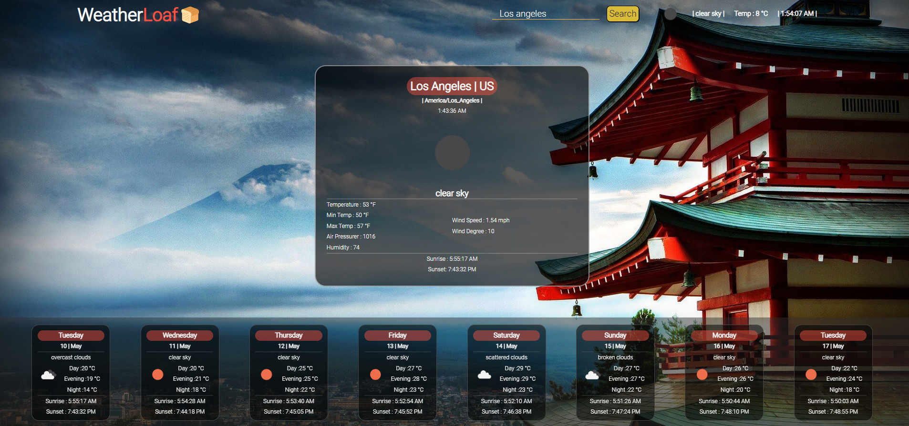

## Dependencies
```
npm i axios, react-router-dom@5, 
```

# WeatherLoaf 🍞
<p> This is a weather searcher, that calls the <a href="https://openweathermap.org/api">OpenWeatherAPI</a>
to fetch the searched city data.</p>
<br/>
<p>GeoLocationAPI is also implemented to grab the user current weather using langtitude and longtitude values</p>
<br/>

# Current Features

<br>

## GeoLocation


Using Geolocation, we grab the current longitude and latitude and pass it on to the OpenWeatherAPI to grab the relevant data needed.

<br>

## OpenWeaterAPI


This API lets you search specific city weathers based on name search, this API has limited calls on it and will refresh after a day

<br/>

Also, the API provides more services such as searching an area based on Longtitude and Latitude values "Hence the GeoLocation"

<br/>

# Future Updates

- Create a "Mobile First Approach"
- Redesign each card
- Add slide animation for main card once a search is initiated